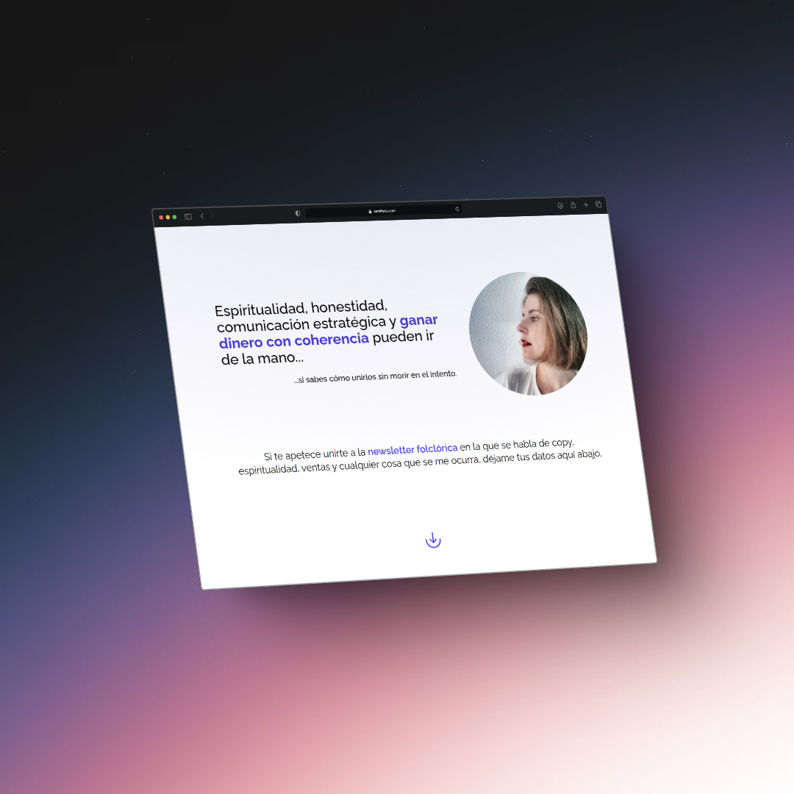

<h1 align='center'>🚀 SARAI FENIX | COPY HIERBAS 🚀 - Sitio Web Oficial 2025</h1>

<div align="center">


Este proyecto web es una landing para [@sarai_fenix](https://www.instagram.com/sarai_fenix), copy espiritual especializada en lanzamientos de infoproductos.

Sitio web desarrollado por [Verlan](https://www.linkedin.com/in/beatriz-martinez-larrucea).

<div style="display: flex; justify-content: center">
  
  
</div>


</div>
> 🧑‍🚀 **Seasoned astronaut?** Delete this file. Have fun!


## 🚀 Project Structure

Inside of your Astro project, you'll see the following folders and files:

```text
/
├── public/
│   └── favicon.svg
├── src/
│   ├── layouts/
│   │   └── Layout.astro
│   └── pages/
│       └── index.astro
└── package.json
```

To learn more about the folder structure of an Astro project, refer to [our guide on project structure](https://docs.astro.build/en/basics/project-structure/).

## 🧞 Commands

All commands are run from the root of the project, from a terminal:

| Command                   | Action                                           |
| :------------------------ | :----------------------------------------------- |
| `npm install`             | Installs dependencies                            |
| `npm run dev`             | Starts local dev server at `localhost:4321`      |
| `npm run build`           | Build your production site to `./dist/`          |
| `npm run preview`         | Preview your build locally, before deploying     |
| `npm run astro ...`       | Run CLI commands like `astro add`, `astro check` |
| `npm run astro -- --help` | Get help using the Astro CLI                     |

## 👀 Want to learn more?

Feel free to check [our documentation](https://docs.astro.build) or jump into our [Discord server](https://astro.build/chat).
